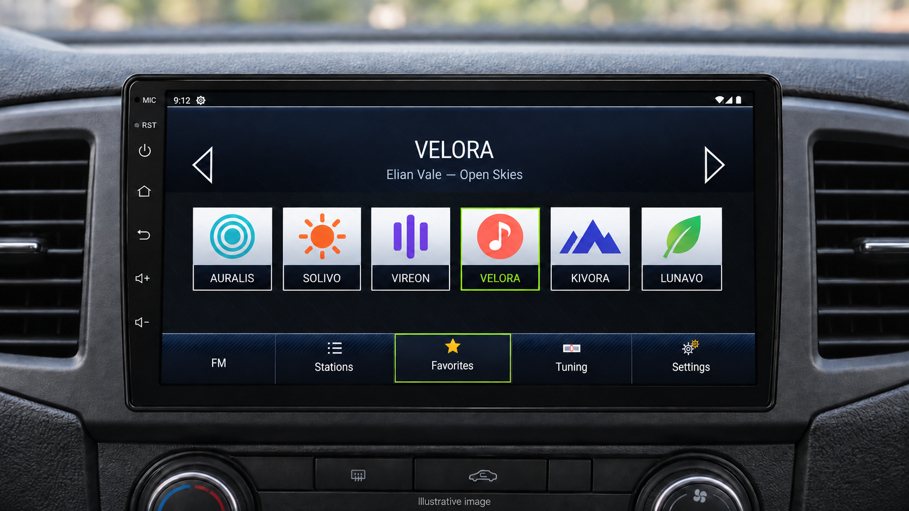

# Radio+

Free, open-source FM/AM radio tested on the **Junsun V7**, with favorites and custom logos.
May also work on other Chinese Android head units with a compatible stock radio service;
compatibility with those devices has not been verified.

**[Download beta APK](https://github.com/edman01/radio-plus-open/releases)**

*AI-assisted illustration with fictional stations and logos. Logos are not included in the app.*

## Compatibility

Android 8.1+ and a compatible stock radio with **FMPlugService** are required.
**Keep the stock radio installed and enabled.** Radio+ does not replace it or change the firmware.

Confirmed working on the maintainer's **Junsun V7**. Other testing is emulator-only;
other models and firmware variants are not verified. [Test details](docs/TESTING.md).

## Using Radio+

Open **Tuning** to find stations. Hold a station to manage favorites, rename it or change its logo.

Languages: English (default), Finnish, German, French, Spanish, Portuguese and Italian.
Choose yours in **Settings → General → Language**.

To import a logo: **Change logo → Add custom logo from device…** → choose a PNG/JPEG from USB or your device.
Use images you have permission to use. [Logo guide](docs/LOGOS.md).

[Install and update](docs/INSTALL.md) · [Build from source](docs/BUILD.md) · [Report a bug](CONTRIBUTING.md)

Independent project, not affiliated with Junsun or Škoda. Configure only while parked.
[MIT license](LICENSE) · [Privacy](docs/PRIVACY.md) · [Third-party notices](THIRD_PARTY_NOTICES.md)
