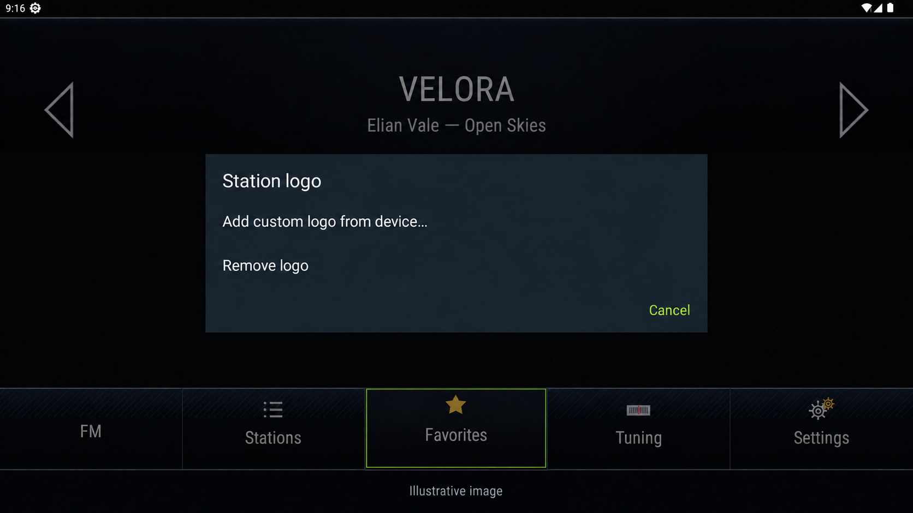

# Import and remove station logos

Radio+ does not bundle, search for or download station logos. Import one image
per station through Android's file picker. Use images you are allowed to use;
this feature does not grant copyright or trademark permissions.

*AI-edited illustration with fictional station data, not an unedited screenshot.*

## From a USB drive

1. Obtain a PNG or JPEG logo and extract any ZIP/RAR archive on your computer.
2. Copy the image files to a USB drive that your head unit can read.
3. Open Radio+ and hold the station card to open its editing menu.
4. Choose **Change logo → Add custom logo from device…**.
5. In the Android document picker, select the USB storage and the image.
6. Wait for the updated card. Repeat for other stations.

If USB storage is missing from the picker, use the device's file manager to copy
the image to **Downloads**, then select it there. The file manager/document
provider is part of your head unit, not Radio+. There is no bulk archive import
or automatic filename-to-station matching.

The app keeps a normalized copy in its private storage. Removing the USB drive
after a successful import does not remove the logo. Images selected from a cloud
provider are fetched by that provider under its own account and privacy rules.

## Size and quality

| Source image | Import behavior |
| --- | --- |
| 160×120 or 168×126 | Original pixel dimensions are preserved |
| 400×240 or 500×500 | Original pixel dimensions are preserved |
| Long side above 512 pixels | Reduced to a maximum long side of 512, keeping aspect ratio |

Prefer a clean PNG with a transparent background when available. JPEG also works.
The UI centers imported logos without stretching their aspect ratio or enlarging
small images. A small source may occupy less of a large card; the importer cannot
reconstruct detail that is not in the original. SVG, PDF and ZIP/RAR are not logo
formats for this workflow. Other Android-decodable image formats are not part of
the documented PNG/JPEG compatibility guarantee.

Some manufacturer download packs contain 160×120 PNGs. Those dimensions are
supported, but the download site's license still controls permitted use. Do not
assume a free download permits redistribution with an app or in a logo collection.

## Change or remove

- Replace: hold the card → **Change logo → Add custom logo from device…**.
- Remove: hold the card → **Change logo → Remove logo**.
- Rename: hold the card → **Rename** (wording may include “station”).

Removing an imported logo does not delete the source file on USB. The station
name/frequency and favorite remain. Without a logo the name or frequency is shown.
Uninstalling/clearing app data removes its private image copies and saved settings.

## If the image does not appear

Check that you selected an actual PNG/JPEG, not an HTML download page, archive or
shortcut. Try opening the image in the device's gallery. Try a reasonably sized
file in Downloads. Re-select the station and inspect its long-press menu. Report
the source dimensions and format, not personal files or copyrighted logo bundles.
